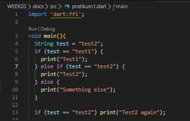
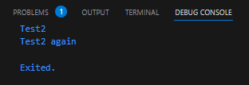
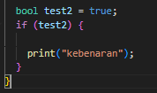
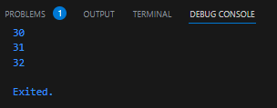
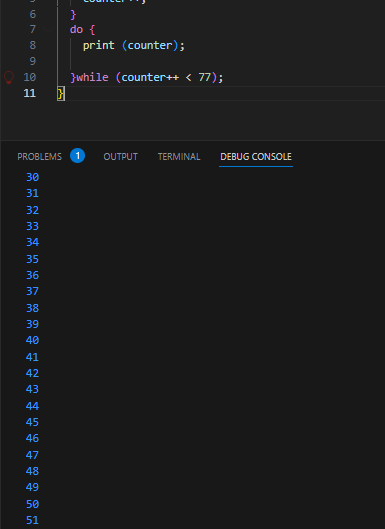
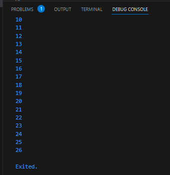
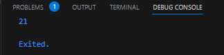
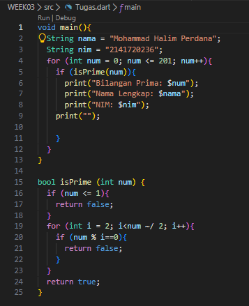
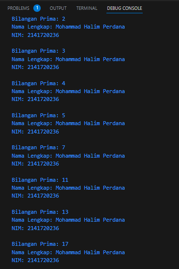

## Pratikum 1

### Langkah 1

### Langkah 2

- Menampilkan output Test2 dan Test2 again karena kode pertama yang menginisialisasi variabel String test dengan nilai "test2". Selanjutnya kode memeriksa apakah test sama dengan "test2" dengan menggunakan pernyatan if yang lain. Karena "test" sama dengan "test2", maka kode mencetak "Test2 again" ke terminal

### Langkah 3

- Untuk kode yang sudah diberikan mengalami eror karena dalam pernyataan "if" harus merupakan nilai boolean. Sedangkan di kode tersebut merupakan String "true" sebagai kondisi. Maka perbaikannya seperti kode dibawah ini dengan mengubah menjadi ekspresi boolean

## Pratikum 2

### Langkah 1

### Langkah 2

- Jika mengeksekusi kode pada langkah satu, maka terjadi eror karena variable counter yang belum diberi nilai pada sebelumnya. Maka perbaikan pada kode yang eror seperti gambar dibawah ini

### Langkah 3
- Saat mengeksekusi program diatas, maka menghasilkan output seperti gambar dibawah ini

## Pratikum 3

### Langkah 1

### Langkah 2

- Saat mengeksekusi program diatas menghasilkan output eror karena kurang mendeklarasikan tipe data variabel index, maka dari itu perlunya mendeklarasikan variabel index dengan tipe datanya terlebih dahulu sebelum menggunakannya dalam loop. Perbaikan kode eror tersebut bisa dilihat pada gambar dibawah ini
### Langkah 3

- Saat menjalankan kode program diatas, mengalami eror pernyataan if, else if, dan else harus ditulis dengan huruf kecil. Lalu tidak terdefinisikan variabel index dan mengharuskan mengisi index dengan nilai 1. Dan menambahkan perulangan for. Untuk perbaikan kode yang eror bisa dilihat pada kode dibawah ini

## Tugas 

### penjelasan
    Anda mendeklarasikan dua variabel string nama dan nim yang berisi nama lengkap dan NIM Anda.

    Anda menggunakan loop for untuk mengulang dari 0 hingga 201 (inklusif) dengan variabel num sebagai variabel loop.

    Di dalam loop, Anda memanggil fungsi isPrime(num) untuk memeriksa apakah nilai num adalah bilangan prima.

    Fungsi isPrime(int num) digunakan untuk memeriksa apakah suatu angka adalah bilangan prima atau bukan. Fungsi ini mengembalikan true jika num adalah bilangan prima, dan false jika tidak.

    Jika fungsi isPrime mengembalikan true, maka Anda mencetak "Bilangan Prima:" diikuti dengan nilai num, "Nama Lengkap:" diikuti dengan isi variabel nama, dan "NIM:" diikuti dengan isi variabel nim. Setelah itu, Anda mencetak baris kosong.
