# Pemograman Mobile - Pertemuan 4
Nama : Mohammad Halim Perdana
Kelas : 3F
Nim : 2141720236

### Pratikum 1 - Eksperimen Tipe Data List
**langkah 1**
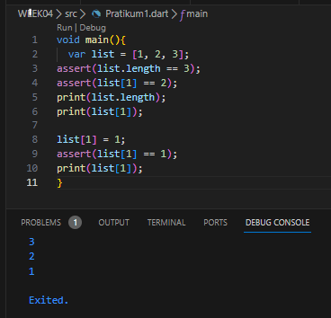
**langkah 2**
karena setiap baris assert menggunakan true, maka tidak terjadi error

**langkah 3**
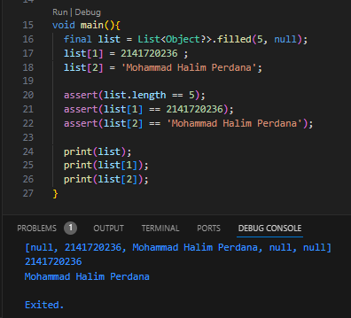

### Pratikum 2 - Eksperimen Tipe Data Set
**Langkah 1**
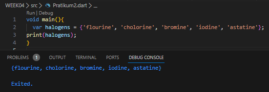
tidak terjadi error karena

**langkah 3**
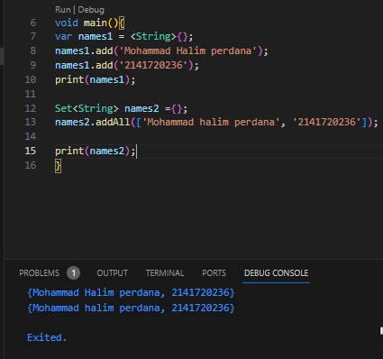

### Pratikum 3 - Eksperimen Tipe Data Maps

**Langkah 1**
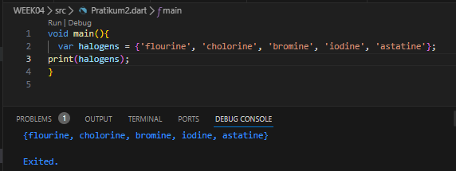

**Langkah 2**
pada saat variabel list di tampilkan, akan menyertakan setiap key dan value 

**Langkah 3**
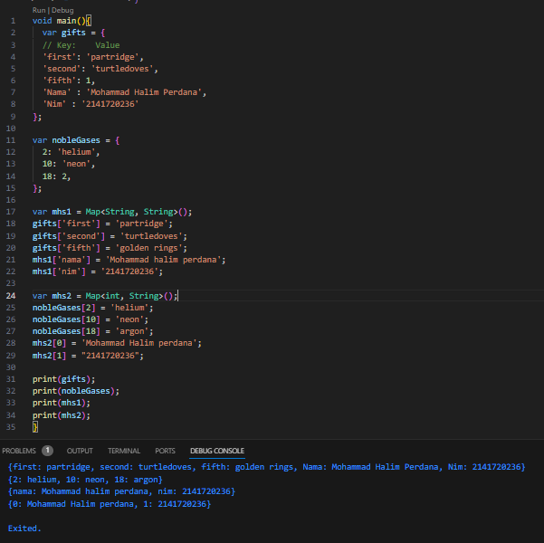

### Pratikum 4 - Eksperimen Tipe Data List: Spread dan Control-flow Operators

**Langkah 1**
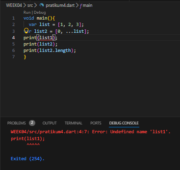

**Langkah 2**
terjadi error karena variabel yang dituju tidak terdefinisi 

**Langkah 3**
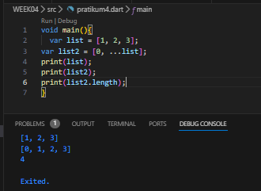

**Langkah 4**

**Langkah 5**
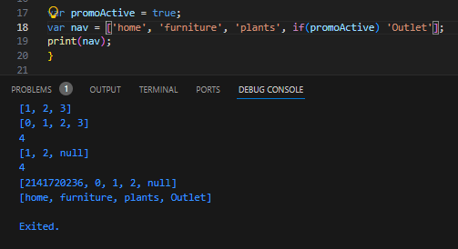

**Langkah 6**
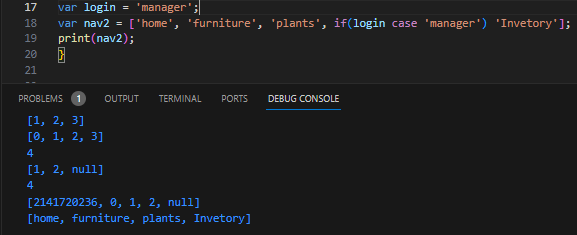

### Pratikum 5 - Eksperimen Tipe Data Records

**Langkah 1**
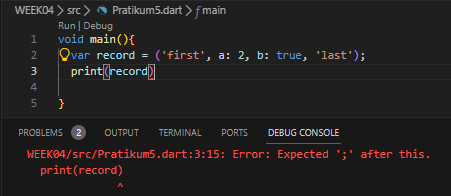

**Langkah 2**
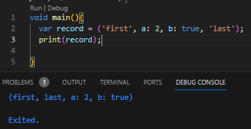

**Langkah 3**
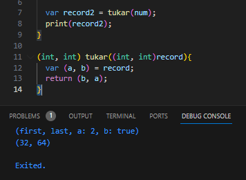

**Langkah 4**
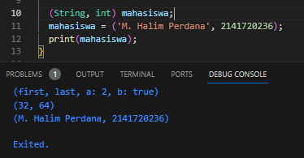

**Langkah 5**
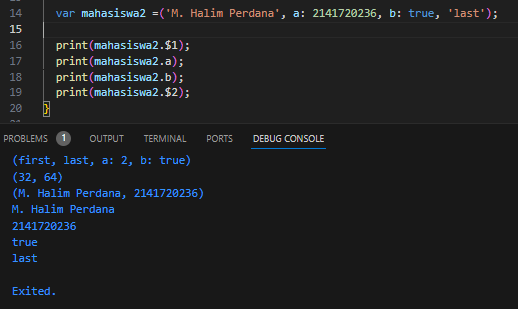

### Tugas Pratikum
**2. jelaskan apa yang di maksud Functions dalam Bahasa Dart!**
 **Jawaban:**
 Jadi Functions adalah Fungsi, nah fungsi ini sebuah blok kode yang digunakan untuk mengesekusi tugas tertentu. dan fungsi ini termasuk Bagian penting dalam pemograman.

**3. jelaskan jenis-jenis Paramater di function dan beserta contoh sintaksnya!**
 **Jawaban:**
 Named Parameters : biasanya digunakan menyebutkan nama variabel parameter saat memanggil fungsi.
 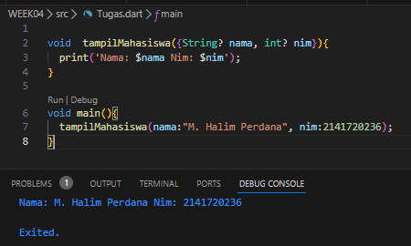
 
 Positional Prameters : biasanya di gunakan untuk menginputkan sebuah parameter yang sesuai susunanya di parameter function yang di panggil
 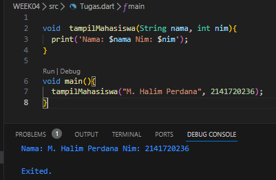

 Default Parameter : parameter ini biasnya memiliki nilai yang default atau nilai awal pada functions
 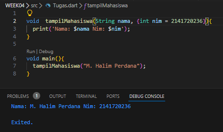

**4. Jelaskan maksud Functions sebagai first-class objects beserta contoh sintaknya!!**
 **Jawaban:**
 Dalam pemrograman, konsep "functions as first-class objects" (fungsi sebagai objek kelas pertama) mengacu pada kemampuan bahasa pemrograman untuk memperlakukan fungsi seperti objek lainnya, seperti variabel, dan dapat menggunakannya dalam cara yang fleksibel. Artinya, fungsi dapat disimpan dalam variabel, dikirim sebagai argumen ke fungsi lain, dan dikembalikan sebagai hasil dari fungsi lain.
  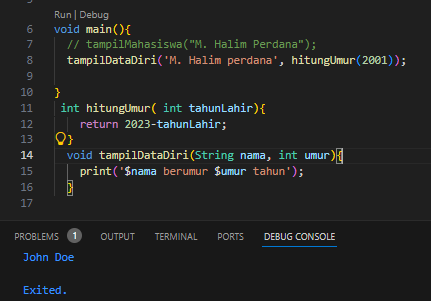
**5. Apa itu Anonymous Functions? Jelaskan dan berikan contohnya!**
 **Jawaban:**
 Anonymous functions, juga dikenal sebagai lambda functions atau closures, adalah fungsi yang tidak memiliki nama secara eksplisit.Dalam anonymous functions, Anda dapat mendefinisikan sebuah fungsi tanpa harus memberikannya nama seperti yang Anda lakukan pada fungsi biasa.
 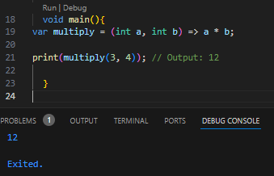

 **6. Jelaskan perbedaan Lexical scope dan Lexical closures! Berikan contohnya**
 **Jawaban:**
 ada 3 perbedaan 
 Lexical scope mengacu pada aturan yang menentukan di mana dalam kode sebuah variabel dapat diakses atau memiliki validitas.
 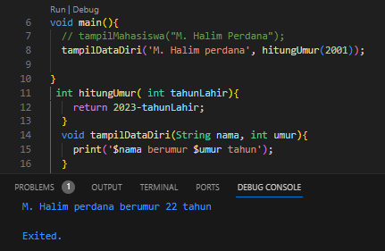

Dalam lexical scope, akses ke variabel tergantung pada struktur kode atau blok tempat variabel tersebut dideklarasikan.
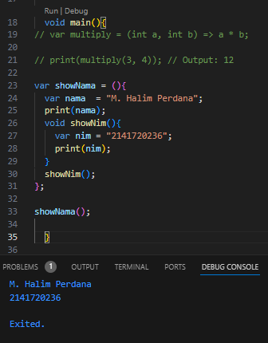

**7. Jelaskan dengan contoh cara membuat return multiple value di Functions!**
 **Jawaban:**
Dalam banyak bahasa pemrograman, termasuk dalam Bahasa Dart, Anda tidak dapat langsung mengembalikan multiple values (nilai-nilai ganda) secara langsung dari sebuah fungsi. Namun, Anda dapat mencapai efek yang sama dengan beberapa cara, seperti menggunakan struktur data yang sesuai atau mengembalikan kumpulan nilai dalam bentuk list atau objek lain.
  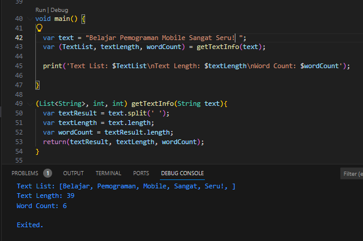