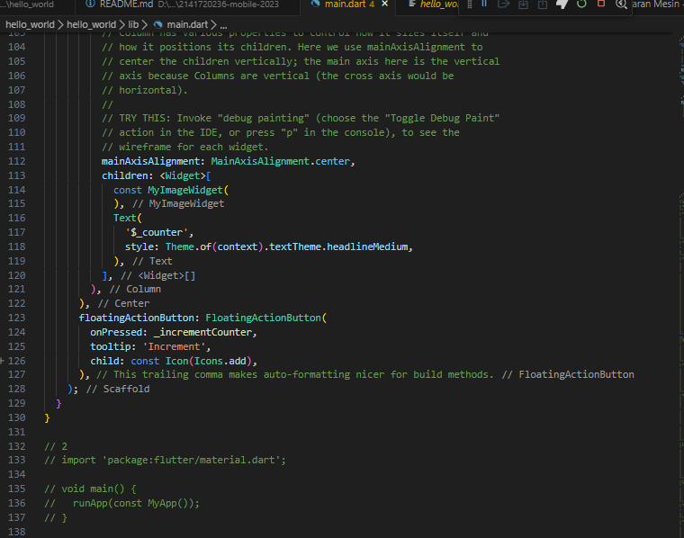
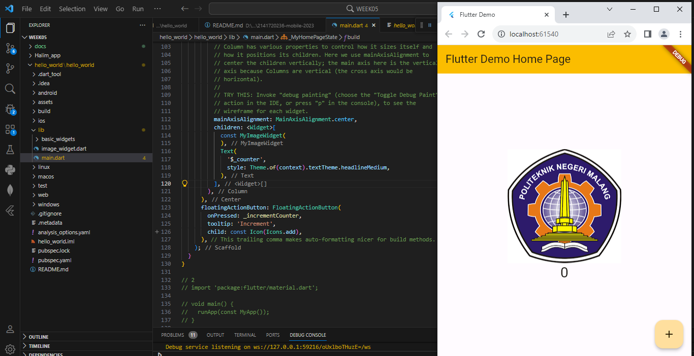
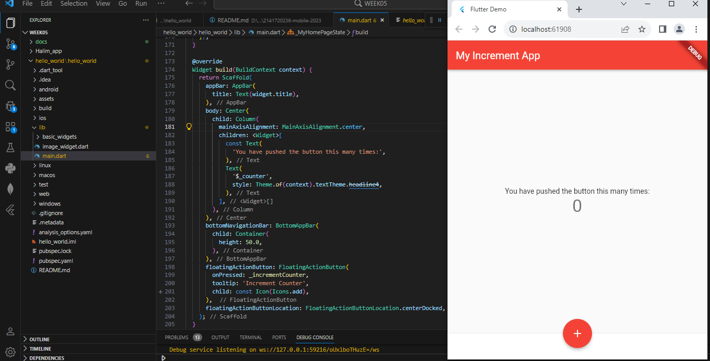
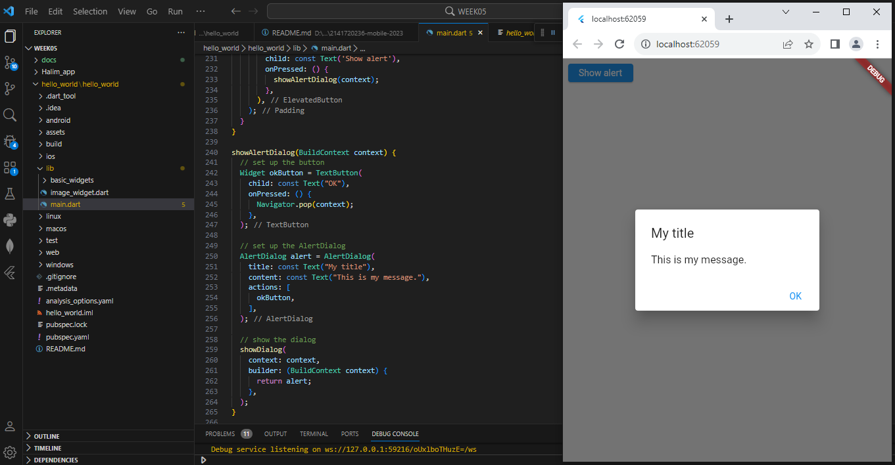

Nama : Mohammad Halim Perdana

Kelas : 2H

Nim : 2141720236

**Pratikum 1 : Membuat Project Flutter Baru**

**Pratikum 2 : Membuat Repository Github dan Laporan Pratikum**

Silakan screenshot seperti pada Langkah 11, namun teks yang ditampilkan dalam aplikasi berupa nama lengkap Anda. Simpan file screenshot dengan nama  **01.png**  pada folder  **images ** (buat folder baru jika belum ada) di project hello\_world Anda. Lalu ubah isi README.md seperti berikut, sehingga tampil hasil screenshot pada file README.md. Kemudian push ke repository Anda.

**Pratikum 3 : Menerapkan Widget Dasar**

**Langkah 1: Text Widget**

Buat folder baru  **basic\_widgets**  di dalam folder  **lib**. Kemudian buat file baru di dalam basic\_widgets dengan nama text\_widget.dart. Ketik atau salin kode program berikut ke project hello\_world Anda pada file text\_widget.dart.

Lakukan import file text\_widget.dart ke main.dart, lalu ganti bagian text widget dengan kode di atas. Maka hasilnya seperti gambar berikut. Screenshot hasil milik Anda, lalu dibuat laporan pada file README.md.

## **Langkah 2: Image Widget**

Buat sebuah file image\_widget.dart di dalam folder basic\_widgets dengan isi kode berikut.

Lakukan penyesuaian asset pada file pubspec.yaml dan tambahkan file logo Anda di folder assets project hello\_world.

Jangan lupa sesuaikan kode dan import di file main.dart kemudian akan tampil gambar seperti berikut.

**Pratikum 4 : Menerapkan Widget Material Design dan IOS Cupertino**

Selesaikan langkah-langkah praktikum berikut ini dengan melanjutkan project hello\_world Anda. Lakukan langkah yang sama seperti pada Praktikum 3, yaitu setiap widget dibuat file sendiri lalu import ke main.dart dan screenshot hasilnya.

## **Langkah 1: Cupertino Button dan Loading Bar**

Buat file di basic\_widgets \> loading\_cupertino.dart. Import stateless widget dari material dan cupertino. Lalu isi kode di dalam method Widget build adalah sebagai berikut.

## **Langkah 2: Floating Action Button (FAB)**

Button widget terdapat beberapa macam pada flutter yaitu ButtonBar, DropdownButton, TextButton, FloatingActionButton, IconButton, OutlineButton, PopupMenuButton, dan ElevatedButton.

Buat file di basic\_widgets \> fab\_widget.dart. Import stateless widget dari material. Lalu isi kode di dalam method Widget build adalah sebagai berikut.

## **Langkah 3: Scaffold Widget**

Scaffold widget digunakan untuk mengatur tata letak sesuai dengan material design.

Ubah isi kode main.dart seperti berikut.

## **Langkah 4: Dialog Widget**

Dialog widget pada flutter memiliki dua jenis dialog yaitu AlertDialog dan SimpleDialog.

Ubah isi kode main.dart seperti berikut.

## **Langkah 5: Input dan Selection Widget**

Flutter menyediakan widget yang dapat menerima input dari pengguna aplikasi yaitu antara lain Checkbox, Date and Time Pickers, Radio Button, Slider, Switch, TextField.

Contoh penggunaan TextField widget adalah sebagai berikut:

## **Langkah 6: Date and Time Pickers**

Date and Time Pickers termasuk pada kategori input dan selection widget, berikut adalah contoh penggunaan Date and Time Pickers.

**Tugas :**

1. Selesaikan Praktikum 1 sampai 4, lalu dokumentasikan dan push ke repository Anda berupa screenshot setiap hasil pekerjaan beserta penjelasannya di file README.md!
2. Pada praktikum 4 mulai dari Langkah 3 sampai 6, buatlah file widget tersendiri di folder basic\_widgets, kemudian pada file main.dart cukup melakukan import widget sesuai masing-masing langkah tersebut!
3. Selesaikan [Codelabs: Your first Flutter app](https://codelabs.developers.google.com/codelabs/flutter-codelab-first#0), lalu buatlah laporan praktikumnya dan push ke repository GitHub Anda!
4. README.md berisi: capture hasil akhir tiap praktikum (_side-by-side_, bisa juga berupa file GIF agar terlihat proses perubahan ketika ada aksi dari pengguna) di browser dan perangkat fisik (_device_) dengan menampilkan NIM dan Nama Anda sebagai ciri pekerjaan Anda. Jika _mode developer_ di perangkat HP Anda belum aktif, silakan cari di internet cara mengaktifkannya!
5. Kumpulkan berupa link repository/commit GitHub Anda ke tautan spreadsheet yang telah disepakati oleh dosen!

**Jawaban :**

2. 

4. 