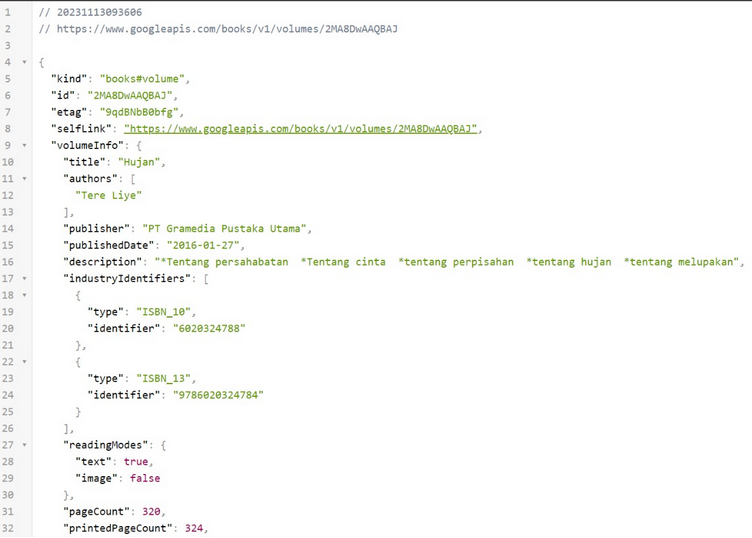
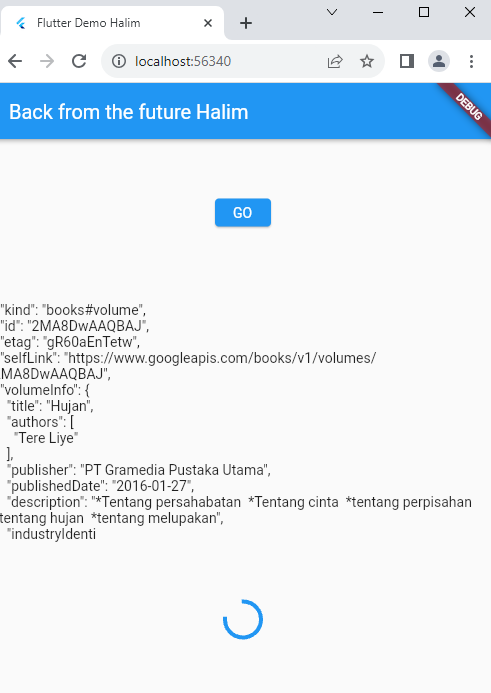

# Pratikum 1

### soal 1
Tambahkan nama panggilan Anda pada title app sebagai identitas hasil pekerjaan Anda.
```dart
return MaterialApp(
      title: 'Flutter Demo Halim',
)
```
### soal 2


Carilah judul buku favorit Anda di Google Books, lalu ganti ID buku pada variabel path di kode tersebut. Caranya ambil di URL browser Anda seperti gambar berikut ini.

Kemudian cobalah akses di browser URI tersebut dengan lengkap seperti ini. Jika menampilkan data JSON, maka Anda telah berhasil. Lakukan capture milik Anda dan tulis di README pada laporan praktikum. Lalu lakukan commit dengan pesan "W12: Soal 2".



### soal 3

Jelaskan maksud kode langkah 5 tersebut terkait substring dan catchError!
result = value.body.toString().substring(0, 450);: Membuat substring dari 0 hingga 449 karakter dari nilai body (mungkin response dari suatu permintaan HTTP atau sumber data lainnya) yang dikonversi ke dalam bentuk string. Substring ini kemudian disimpan dalam variabel result.

catchError((_) {...}): Ini digunakan untuk menangani kesalahan (error) yang terjadi saat getData() gagal dilakukan.
result = 'An error occured'; : Mengubah nilai variabel result menjadi string 'An error occurred' sebagai tanda bahwa terjadi kesalahan. setState(() {});: Kembali memanggil setState() untuk memberitahu Flutter bahwa state telah berubah, dan tampilan perlu diperbarui.

Capture hasil praktikum Anda berupa GIF dan lampirkan di README. Lalu lakukan commit dengan pesan "W12: Soal 3".



code inti pratikum 1
```dart
// pratikum1
  Future<Response> getData() async {
    const authority = 'www.googleapis.com';
    const path = '/books/v1/volumes/2MA8DwAAQBAJ';
    Uri url = Uri.https(authority, path);
    return http.get(url);
  }
```

```dart
onPressed: () {
              // Pratikum1
               setState(() {});
               getData().then((value){
                 result = value.body.toString().substring(0, 450);
                 setState(() {});
               }).catchError((_){
                 result = 'An error occured';
                setState(() {});
              });
}
```

# Pratikum 2

### soal 4
Jelaskan maksud kode langkah 1 dan 2 tersebut!
await Future.delayed(const Duration(seconds: 3));: Ini adalah operasi penundaan selama 3 detik menggunakan Future.delayed. dan digunakan selama 3 kali hasilnya menjadi delay 9 detik. dan mereturnkan nilai masing2 Future count digunakan untuk menjumlahkan returnOne yang bernilai 1 lalu returnTwo yang bernilai 2 dan returnThree yang bernilai 3 disertai delay 3 detik dari masing2 Future
Capture hasil praktikum Anda berupa GIF dan lampirkan di README. Lalu lakukan commit dengan pesan "W12: Soal 4".
.gif)

code inti pratikum 2
```dart
// pratikum2
  Future<int> returnOneAsync() async {
    await Future.delayed(const Duration(seconds: 3));
    return 1;
  }

  Future<int> returnTwoAsync() async {
    await Future.delayed(const Duration(seconds: 3));
    return 2;
  }

  Future<int> returnThreeAsync() async {
    await Future.delayed(const Duration(seconds: 3));
    return 3;
  }

  Future count() async {
    int total = 0;
    total = await returnOneAsync();
    total += await returnTwoAsync();
    total += await returnThreeAsync();
    setState(() {
      result = total.toString();
    });
  }
```
```dart
//pratikum 2
count();
```

# Pratikum 3

### soal 5
Jelaskan maksud kode langkah 2 tersebut! maksud kode langkah 2 adalah getNumber memanggil calculate dimana calculate mempunyai delay 5s dan nilai 42 dan di panggil lewat completer.future yang ada di getNumber.
Capture hasil praktikum Anda berupa GIF dan lampirkan di README. Lalu lakukan commit dengan pesan "W12: 

### Soal 5".

.gif)

### Soal 6
.gif)

code inti pratikum 3

```dart
// pratikum 3
  late Completer completer;

  Future getNumber() {
    completer = Completer<int>();
    calculate();
    return completer.future;
  }

  Future calculate() async {
    await Future.delayed(const Duration(seconds: 5));
    completer.complete(42);
  }

  calculate2() async {
    try {
      await new Future.delayed(const Duration(seconds: 5));
      completer.complete(42);
    } catch (_) {
      completer.completeError({});
    }
  }
```
```dart
pratikum3
    getNumber().then((value) => {
       setState(() {
                 result = value.toString();
                    })
                  });
               getNumber().then((value) {
                 setState(() {
                   result = value.toString();
                 });
               }).catchError((e) {
                 result = 'An error occurred';
               });
```

# Pratikum 4

### soal 7
Capture hasil praktikum Anda berupa GIF dan lampirkan di README. Lalu lakukan commit dengan pesan "W12: Soal 7"
.gif)

### soal 8
Jelaskan maksud perbedaan kode langkah 1 dan 4!

### Jawaban
perbedaan utama anatara kedua langkah terletak pada bagaimana cara mengelola dan menunggu melakukan pengelompokan Future.

code inti pratikum 4
```dart
void returnFG() {
    FutureGroup<int> futureGroup = FutureGroup<int>();
    futureGroup.add(returnOneAsync());
    futureGroup.add(returnTwoAsync());
    futureGroup.add(returnThreeAsync());
    futureGroup.close();
    futureGroup.future.then((List<int> value) {
      int total = 0;
      for (var element in value) {
        total += element;
      }
      setState(() {
        result = total.toString();
      });
    });

    final futures = Future.wait([
      returnOneAsync(),
      returnTwoAsync(),
      returnThreeAsync(),
    ]);
}
```

```dart
//pratikum 4
returnFG();
```

# Pratikum 5
Capture hasil praktikum Anda berupa GIF dan lampirkan di README. Lalu lakukan commit dengan pesan "W12: 

### Soal 9
.gif)

### Soal 10
.png)

### Perbedaan
Perbedaan utama terletak pada pendekatan penanganan kesalahan. Kode pertama menggunakan metode .then().catchError().whenComplete() untuk menangani hasil atau kesalahan yang mungkin terjadi dari returnError(), sedangkan kode kedua menggunakan blok try-catch-finally di dalam fungsi handleError() untuk secara langsung menangkap dan menangani error yang muncul dari pemanggilan returnError(), dengan bagian finally digunakan untuk mengeksekusi kode akhir, independen dari apakah ada error atau tidak

# Pratikum 6

### Soal 11
```dart
return Scaffold(
      appBar: AppBar(
        title: const Text('Halim'),
      ),)
```

### Soal 12
Jika Anda tidak melihat animasi loading tampil, kemungkinan itu berjalan sangat cepat. Tambahkan delay pada method getPosition() dengan kode await Future.delayed(const Duration(seconds: 3));
.png)

### Jawaban
 bisa, karena Jika menjalankan di browser, koordinat GPS masih dapat muncul atau diperoleh. Ini disebabkan oleh Flutter web yang menggunakan API Geolocation langsung dari browser. Pada Flutter web, izin untuk mengakses lokasi dikelola oleh browser, bukan oleh sistem operasi (seperti Android pada perangkat seluler). Oleh karena itu, meskipun tidak menambahkan izin secara langsung ke AndroidManifest, koordinat GPS masih dapat diperoleh di browser, tetapi tetap memerlukan izin dari pengguna.

 # Pratikum 7
 
 ### Soal 13
 Apakah ada perbedaan UI dengan praktikum sebelumnya? Mengapa demikian?

Dari kedua praktikum tersebut tidak memiliki perbedaan UI. Keduanya tetap menampilkan koordinat Geolokasi dengan layout yang sama. Hal ini terjadi karena keduanya masih mengambil lokasi secara sinkron dalam blok initState. Pada tampilan UI keduanya memiliki delay yang sama, yaitu 3 detik. Selain itu, UI dapat terlihat sama karena FutureBuilder secara otomatis mengelola pembaruan UI, bahkan tanpa pemanggilan setState langsung.

Capture hasil praktikum Anda berupa GIF dan lampirkan di README. Lalu lakukan commit dengan pesan "W12: 

.png)

### Soal 14
Apakah ada perbedaan UI dengan langkah sebelumnya? Mengapa demikian?
sama saja tidak ada bedanya, karena cuma nambahin eror dan di kode ini tidak terdapat eror
Capture hasil praktikum Anda berupa GIF dan lampirkan di README. Lalu lakukan commit dengan pesan "W12: Soal 14".

.gif)

# Pratikum 8

### Soal 15
Tambahkan nama panggilan Anda pada tiap properti title sebagai identitas pekerjaan Anda.
```dart
appBar: AppBar(
        title: const Text('Halim'),)

```
Silahkan ganti warna Favorit anda
```dart
Color color = Colors.orange.shade400;
```
### Soal 16
Cobalah klik setiap button, apa yang terjadi ? Mengapa demikian ?
Ketika button di klik warnanya akan mengalami perubahan sesuai dengan konfigurasi yang telah ditentukan pada ElevatedButton() dalam class navigation_second.dart. Hal ini disebabkan oleh adanya fungsi Navigation.pop() pada setiap button dengan parameter berupa context dan color yang telah ditetapkan. Sehingga, setiap kali button diklik, warna yang ditampilkan akan bervariasi sesuai dengan nilai variabel color yang telah diatur.
Gantilah 3 warna pada langkah 5 dengan warna favorit Anda!

```dart
 ElevatedButton(
              onPressed: () {
                color = Colors.orange.shade400;
                Navigator.pop(context, color);
              },
              child: const Text('Orange'),
            ),
            ElevatedButton(
              onPressed: () {
                color = Colors.blue.shade300;
                Navigator.pop(context, color);
              },
              child: const Text('Blue'),
            ),
            ElevatedButton(
              onPressed: () {
                color = Colors.pink.shade300;
                Navigator.pop(context, color);});
```
.gif)

# Pratikum 9

### Soal 17
Cobalah klik setiap button, apa yang terjadi ? Mengapa demikian ?
ketika klik changecolor muncul alert/dialog untuk memilih warna untuk mengubah warna background. Proses ini terjadi karena nilai color diperbarui dengan nilai yang dipilih dalam fungsi _showColorDialog, dan setelah itu widget diperbarui menggunakan setState. Hal ini menyebabkan widget dibangun kembali dan menunjukkan perubahan warna di layar.
Gantilah 3 warna pada langkah 3 dengan warna favorit Anda!

```dart
TextButton(
                  onPressed: () {
                    color = Colors.black;
                    Navigator.pop(context, color);
                  },
                  child: const Text("Black")),
              TextButton(
                  onPressed: () {
                    color = Colors.white;
                    Navigator.pop(context, color);
                  },
                  child: const Text("White")),
              TextButton(
                  onPressed: () {
                    color = Colors.green.shade400;
                    Navigator.pop(context, color);
                  },)
```
.gif)


