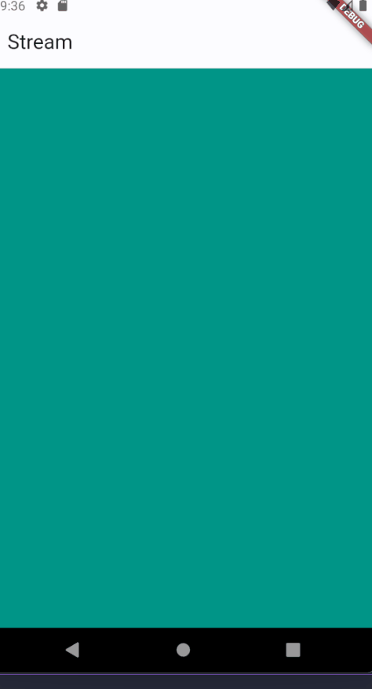

# 3. Praktikum 1: Dart Streams
Selesaikan langkah-langkah praktikum berikut ini menggunakan editor Visual Studio Code (VS Code) atau Android Studio atau code editor lain kesukaan Anda. Jawablah di laporan praktikum Anda (ketik di README.md) pada setiap soal yang ada di beberapa langkah praktikum ini.
### Langkah 1: Buat Project Baru
Buatlah sebuah project flutter baru dengan nama stream_nama (beri nama panggilan Anda) di folder week-13/src/ repository GitHub Anda.

### Langkah 2: Buka file main.dart
Ketiklah kode seperti berikut ini.

### Soal 1
```dart
import 'package:flutter/material.dart';

void main() {
  runApp(const MyApp());
}

class MyApp extends StatelessWidget {
  const MyApp({super.key});

  @override
  Widget build(BuildContext context) {
    return MaterialApp(
      title: 'Halim',
      theme: ThemeData(
        colorScheme: ColorScheme.fromSeed(seedColor: Colors.deepPurple),
        useMaterial3: true,
      ),
      home: const StreamHomePage(),
    );
  }
}

class StreamHomePage extends StatefulWidget {
  const StreamHomePage({super.key});

  @override
  State<StreamHomePage> createState() => _MyHomePageState();
}

class _MyHomePageState extends State<StreamHomePage> {
  @override
  Widget build(BuildContext context) {
    return Container();
  }
}
```
### Langkah 4: Tambah variabel colors
Tambahkan variabel di dalam class ColorStream seperti berikut.

### Soal 2
```dart
import 'package:flutter/material.dart';

class ColorStream {
  final List<Color> colors = [
    Colors.blueGrey,
    Colors.amber,
    Colors.deepPurple,
    Colors.lightBlue,
    Colors.teal,
    Colors.pink,
    Colors.red,
    Colors.orange,
    Colors.green,
    Colors.blue.shade900,
  ];
}
```

### Langkah 5: Tambah method getColors()
Di dalam class ColorStream ketik method seperti kode berikut. Perhatikan tanda bintang di akhir keyword async* (ini digunakan untuk melakukan Stream data)

### Langkah 6: Tambah perintah yield*
Tambahkan kode berikut ini.

### Soal 3

-  Jelaskan fungsi keyword yield* pada kode tersebut! Jawab: Sintaks yield* digunakan untuk mengembalikan data setiap ada perubahan. Hampir sama dengan sintaks return di Future, namun jika di Future data hanya dikembalikan 1x, di Stream data akan dikembalikan setiap ada perubahan.
-   Apa maksud isi perintah kode tersebut? Jawab: Perintah kode tersebut membuat sebuah function Stream dimana setiap 1 detik sekali akan merubah warna sesuai dengan list warna yang sudah di deklarasikan.
Lakukan commit hasil jawaban Soal 3 dengan pesan "W13: Jawaban Soal 3"

### Langkah 7: Buka main.dart
Ketik kode impor file ini pada file main.dart

### Langkah 8: Tambah variabel
Ketik dua properti ini di dalam class _StreamHomePageState

### Langkah 9: Tambah method changeColor()
Tetap di file main, Ketik kode seperti berikut

### Langkah 10: Lakukan override initState()
Ketika kode seperti berikut

### Langkah 11: Ubah isi Scaffold()
Sesuaikan kode seperti berikut.

### Langkah 12: Run
Lakukan running pada aplikasi Flutter Anda, maka akan terlihat berubah warna background setiap detik.

### Soal 4
Capture hasil praktikum Anda berupa GIF dan lampirkan di README.
Lakukan commit hasil jawaban Soal 4 dengan pesan "W13: Jawaban Soal 4"


### Langkah 13: Ganti isi method changeColor()

Anda boleh comment atau hapus kode sebelumnya, lalu ketika kode seperti berikut.
### Soal 5
Jelaskan perbedaan menggunakan listen dan await for (langkah 9) ! Jawab: Listen digunakan untuk memberikan fungsi callback ketika ada perubahan pada stream. Sedangkan await for akan melakukan iterasi setiap nilai yang didapatkan dari stream.
Lakukan commit hasil jawaban Soal 5 dengan pesan "W13: Jawaban Soal 5"

### Praktikum 2: Stream controllers dan sinks
StreamControllers akan membuat jembatan antara Stream dan Sink. Stream berisi data secara sekuensial yang dapat diterima oleh subscriber manapun, sedangkan Sink digunakan untuk mengisi (injeksi) data.

Secara sederhana, StreamControllers merupakan stream management. Ia akan otomatis membuat stream dan sink serta beberapa method untuk melakukan kontrol terhadap event dan fitur-fitur yang ada di dalamnya.

Anda dapat membayangkan stream sebagai pipa air yang mengalir searah, dari salah satu ujung Anda dapat mengisi data dan dari ujung lain data itu keluar. Anda dapat melihat konsep stream pada gambar diagram berikut ini.

### Langkah 1: Buka file stream.dart
Lakukan impor dengan mengetik kode ini.

### Langkah 2: Tambah class NumberStream
Tetap di file stream.dart tambah class baru seperti berikut.

### Langkah 3: Tambah StreamController
Di dalam class NumberStream buatlah variabel seperti berikut.

### Langkah 4: Tambah method addNumberToSink
Tetap di class NumberStream buatlah method ini


### Langkah 5: Tambah method close()


### Langkah 6: Buka main.dart
Ketik kode import seperti berikut


### Langkah 7: Tambah variabel
Di dalam class _StreamHomePageState ketik variabel berikut


### Langkah 8: Edit initState()


### Langkah 9: Edit dispose()


### Langkah 10: Tambah method addRandomNumber()
void addRandomNumber() {
  Random random = Random();
  int myNum = random.nextInt(10);
  numberStream.addNumberToSink(myNum);
}
### Langkah 11: Edit method build()


### Langkah 12: Run
Lakukan running pada aplikasi Flutter Anda, maka akan terlihat seperti gambar berikut.

.gif)

### Langkah 13: Buka stream.dart
Tambahkan method berikut ini.

### Langkah 14: Buka main.dart
Tambahkan method onError di dalam class StreamHomePageState pada method listen di fungsi initState() seperti berikut ini.


### Langkah 15: Edit method addRandomNumber()
Lakukan comment pada dua baris kode berikut, lalu ketik kode seperti berikut ini.

### Soal 7
- Pada langkah 13Pada langkah ini, Anda menambahkan sebuah metode bernama addError() ke dalam objek NumberStream yang mungkin merupakan suatu kelas yang mengelola stream angka. Metode ini bertujuan untuk menambahkan pesan error ke dalam sink (tempat penyimpanan) stream dengan menggunakan controller.sink.addError('error').

- Pada langkah 14Pada langkah ini, Anda menambahkan metode onError ke dalam fungsi listen yang mendengarkan perubahan pada stream dalam fungsi initState(). Ketika terjadi error pada stream, fungsi onError akan dipanggil, dan Anda mengupdate nilai lastNumber menjadi -1. Ini memberikan cara untuk menangani kesalahan yang mungkin terjadi pada stream.

- Pada langkah 15Pada langkah ini, Anda melakukan komentar pada dua baris kode yang awalnya digunakan untuk menambahkan angka acak ke dalam stream. Ini berarti bahwa metode addRandomNumber() sekarang tidak melakukan apa pun, dan angka tidak lagi ditambahkan ke dalam stream.